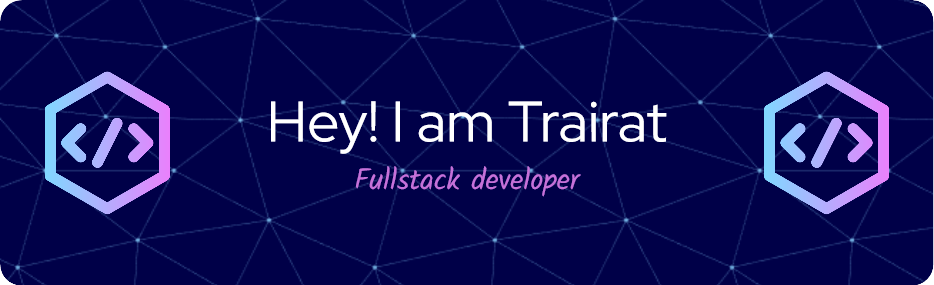

🎊สวัสดีครับ ผม ตรัยรัตน์ แก้วสอาด เป็นคนที่ชื่นชอบในการเขียนโค๊ด
 

## My Skills 🐝

 

## 🌻 Quotes
> "Imagination is more important than knowledge - จินตนาการสำคัญกว่าความรู้"
>
> ~ อัลเบิร์ต ไอน์สไตน์ (Albert Einstein) ~

<!--
**eurekaMarch/eurekaMarch** is a ✨ _special_ ✨ repository because its `README.md` (this file) appears on your GitHub profile.

Here are some ideas to get you started:

- 🔭 I’m currently working on ...
- 🌱 I’m currently learning ...
- 👯 I’m looking to collaborate on ...
- 🤔 I’m looking for help with ...
- 💬 Ask me about ...
- 📫 How to reach me: ...
- 😄 Pronouns: ...
- ⚡ Fun fact: ...
-->
